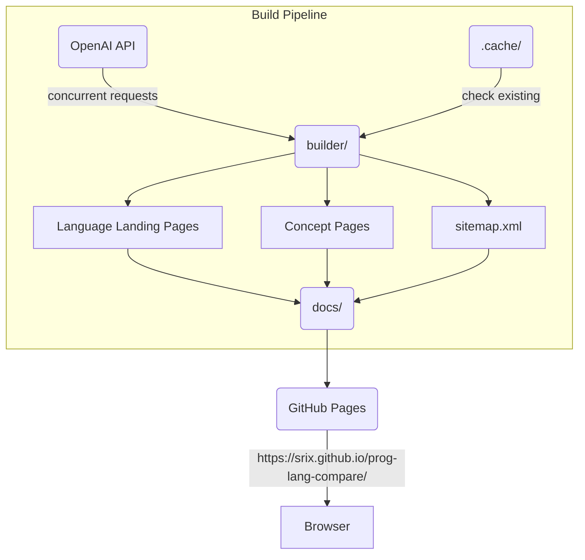

# Programming Language Comparison

Compare programming concepts across 23+ languages side by side with AI-generated explanations and code examples.

**🌐 Live Site**: [https://srix.github.io/prog-lang-compare/](https://srix.github.io/prog-lang-compare/)

---

## Features

- 🔍 **2,500+ SEO-optimized pages** - Deep searchengine indexing for every concept
- 📚 **23+ programming languages** - Python, JavaScript, Rust, Go, Java, and more
- 🤖 **AI-generated content** - Detailed explanations using GPT-3.5 Turbo
- ⚡ **Lazy loading** - Fast initial page load, concepts load on demand
- 🔎 **Interactive comparison table** - Search, filter, and compare side-by-side
- 🔗 **Internal linking** - Easy navigation between languages for the same concept
- 📱 **Responsive design** - Works on desktop and mobile

---

## Quick Start

### Prerequisites
- Python 3.11+
- OpenAI API key ([Get one here](https://platform.openai.com/api-keys))

### Setup

1. **Clone the repository**
```bash
git clone https://github.com/srix/prog-lang-compare.git
cd prog-lang-compare
```

2. **Install dependencies**
```bash
pip install -r requirements.txt
```

3. **Configure API keys**
```bash
cp .env.example .env
# Edit .env and add your OpenAI API keys
```

### Build

**Quick build (one command):**
```bash
./build.sh
```

This generates:
- 21 language landing pages
- 2,500+ concept pages with code examples
- sitemap.xml for search engines

**Preview locally:**
```bash
cd docs && python -m http.server 8000
# Visit http://localhost:8000
```

---

## Architecture



### Directory Structure

```
docs/                  # GitHub Pages deployment directory
├── index.html         # Main interactive comparison table
├── script.js          # Frontend JavaScript (vanilla JS)
├── concepts/          # 2,500+ static SEO-optimized pages
│   ├── python-310.html          # Language landing page
│   └── python-310/
│       └── string_concatenation.html  # Concept pages
├── content-autogen/   # AI-generated JSON content
└── sitemap.xml        # Search engine sitemap

builder/               # Python content generators
├── main.py            # AI content generation from OpenAI
├── generate_language_landing.py   # Creates language index pages
├── generate_static_pages.py       # Creates SEO concept pages
├── generate_sitemap.py            # Generates sitemap.xml
└── generate_social_image.py       # Creates social preview image
```

---

## How It Works

1. **Content Generation** (`builder/main.py`)
   - Reads concept templates from `prog_lang_concepts.yaml`
   - Makes concurrent OpenAI API calls for each language-concept pair
   - Caches results to avoid redundant API calls
   - Outputs JSON files to `docs/content-autogen/`

2. **Static Page Generation** (`builder/generate_static_pages.py`)
   - Converts JSON to SEO-friendly HTML pages
   - Adds meta tags, Open Graph, Twitter Cards
   - Includes structured data (Schema.org)
   - Adds internal links to related concepts

3. **Language Landing Pages** (`builder/generate_language_landing.py`)
   - Creates index page for each language
   - Lists all 108 concepts per language
   - Fixes breadcrumb navigation

4. **Sitemap** (`builder/generate_sitemap.py`)
   - Generates sitemap.xml with all pages
   - Uses git history for accurate lastmod dates
   - Prioritizes language pages (0.9) over concept pages (0.8)

---

## Development

### Adding a New Language

1. Edit `docs/prog_langs.yaml`:
```yaml
Programming Languages:
  - Python 3.10
  - Your New Language
```

2. Run the build:
```bash
./build.sh
```

### Adding a New Concept

1. Edit `docs/prog_lang_concepts.yaml`:
```yaml
YourCategory:
  Your Concept: "Explain how to [concept] in {lang} with examples."
```

2. Regenerate content:
```bash
python builder/main.py          # Generates AI content
./build.sh                      # Builds all pages
```

### Regenerating All Content

Delete the cache and rebuild:
```bash
rm -rf .cache/
python builder/main.py
./build.sh
```

---

## Deployment

The site auto-deploys from the `docs/` directory on GitHub Pages.

**To deploy changes:**
```bash
./build.sh                      # Generate all pages
git add docs/
git commit -m "feat: Update language comparison content

🤖 Generated with Claude Code"
git push origin main
```

GitHub Pages automatically publishes from the `docs/` folder on the `main` branch.

---

## Technologies

### Backend
- **Python 3.11** - Content generation scripts
- **OpenAI API (GPT-3.5 Turbo)** - AI-generated explanations
- **PyYAML** - Configuration file parsing
- **Tenacity** - Retry logic with exponential backoff

### Frontend
- **Vanilla JavaScript** - No framework, lightweight
- **DataTables** - Interactive table with search/filter
- **Marked.js** - Markdown to HTML conversion
- **Highlight.js** - Syntax highlighting for code blocks

### Infrastructure
- **GitHub Pages** - Free hosting
- **GitHub Actions** - CI/CD (planned)

---

## SEO Optimization

- ✅ **2,500+ static pages** for deep indexing
- ✅ **Semantic HTML** with proper heading hierarchy
- ✅ **Meta tags** (title, description, keywords)
- ✅ **Open Graph** tags for social sharing
- ✅ **Twitter Cards** for rich previews
- ✅ **Structured data** (Schema.org TechArticle)
- ✅ **Sitemap.xml** with 2,500+ URLs
- ✅ **robots.txt** with crawl directives
- ✅ **Internal linking** between related concepts
- ✅ **Canonical URLs** to prevent duplicate content
- ✅ **Dynamic lastmod dates** from git history

---

## Credits

- Concept list inspired by [lang-compare](https://github.com/evmorov/lang-compare) by @evmorov
- Built with [Claude Code](https://claude.ai/code)

---

## License

This project is licensed under the Apache License 2.0 - see the [LICENSE](LICENSE) file for details.

### What This Means

You are free to:
- ✅ Use this project commercially
- ✅ Modify and distribute
- ✅ Use privately
- ✅ Include patent grants

Under these conditions:
- 📄 Include a copy of the license
- 📝 State changes made to the code
- 🔒 Include original copyright notices
- ⚖️ Don't hold contributors liable

---

## Contributing

Contributions are welcome! Please feel free to submit a Pull Request.

1. Fork the repository
2. Create your feature branch (`git checkout -b feature/amazing-feature`)
3. Commit your changes (`git commit -m 'Add amazing feature'`)
4. Push to the branch (`git push origin feature/amazing-feature`)
5. Open a Pull Request  
